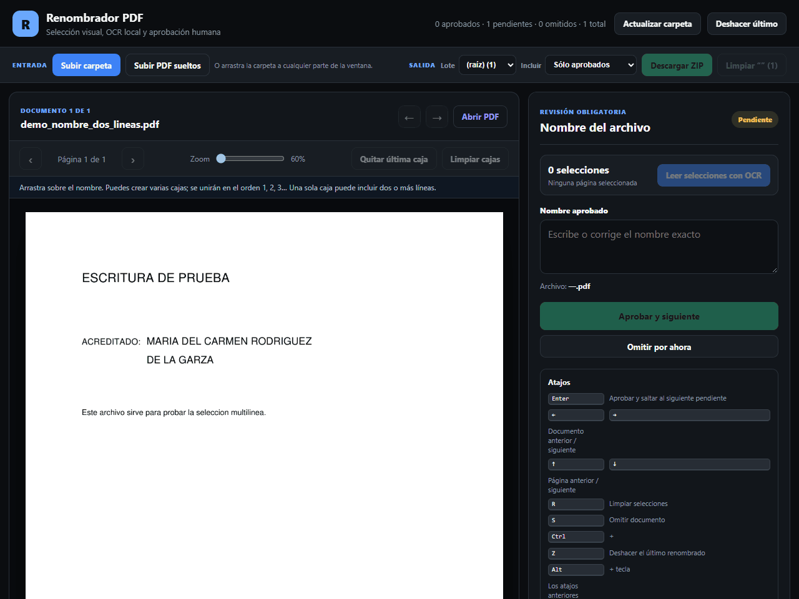
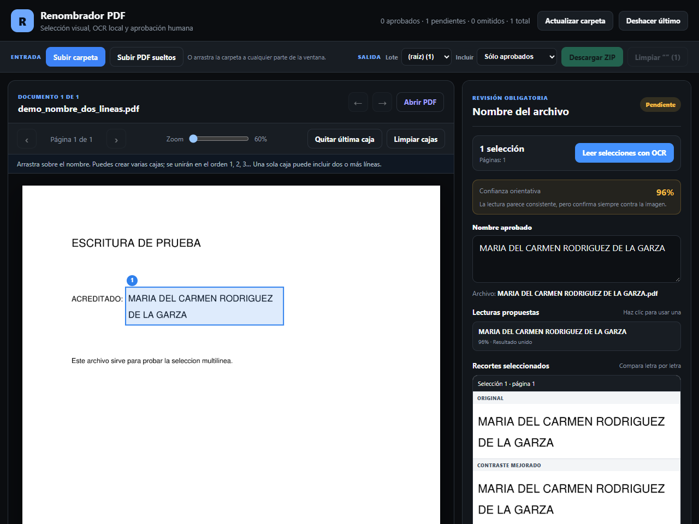
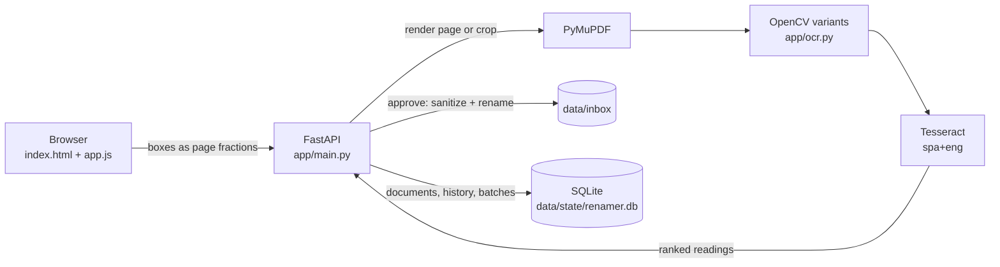

# Renombrador PDF

[Versión en español](README.es.md)

Batch-rename scanned PDFs: mark where the name is, let OCR read it, and approve every name before a file changes.

Renombrador PDF (Spanish for "PDF renamer") is a local web app for offices that receive stacks of scanned documents with names like `scan_0001.pdf` and need each file named after the person in it. You draw a box around the name, the app runs Tesseract on that region only and proposes a filename, and nothing is renamed until a person has compared the proposal with the crop and approved it. The interface is in Spanish because it was built for a Spanish-speaking office; [README.es.md](README.es.md) is the user guide.



*Recorded with the demo PDF from `generate_demo_pdf.py`; the name in it is made up. There is no hosted demo: the app reads and renames files on your own disk.*

**Contents:** [Features](#features) · [How it works](#how-it-works) · [Engineering highlights](#engineering-highlights) · [Tech stack](#tech-stack-and-design-decisions) · [Getting started](#getting-started) · [Tests, lint and CI](#tests-lint-and-ci) · [Configuration](#configuration) · [Limitations](#limitations) · [License](#license) · [Author](#author)

## Features

- **Folder upload from the browser.** Use the folder picker, pick loose PDFs, or drag a folder onto the window. Subfolders are kept. If a batch name is already taken, the new one gets ` (2)`. You can also copy PDFs into `data/inbox` and press *Actualizar carpeta* (refresh folder).
- **OCR on marked regions only.** Draw one or more boxes. One box can cover a name that wraps onto several lines, and several boxes, even on different pages, are joined in order 1, 2, 3.
- **Several readings, flagged when unsure.** Each box goes through five image preprocessing variants in two Tesseract page-segmentation modes, plus a word-by-word pass that rebuilds spacing from the gaps in the ink. The best reading is proposed next to the original and contrast-enhanced crops; with a single box, the other readings are one click away. A result is flagged for review when confidence is below 60, when it contains stray punctuation, or when the readings disagree, even at high confidence.
- **Safe renames.** Accents are kept, characters Windows rejects are replaced, and reserved names such as `CON` or `LPT1` get a suffix. An existing file is never overwritten: ` (2)`, ` (3)` is appended instead. Only the file name changes; the PDF's content is not touched.
- **Skip, undo and history.** You can skip a hard document. Undo walks renames back newest-first and refuses if the old name has since been taken. Every rename, skip and undo is logged in SQLite.
- **ZIP export and cleanup.** Export one batch or everything, approved files only or all files; a one-batch ZIP has the files at its root, a full ZIP keeps one folder per batch. Deleting a batch afterwards asks for confirmation and warns if renamed files were never exported.
- **Keyboard flow.** `Enter` approves and jumps to the next pending document. The arrow keys move between documents and pages. Hold `Alt` to use the shortcuts while typing in the name field.
- **Offline.** Rendering and OCR run on your machine, and the app calls no external service.

## How it works

1. **Mark.** Drag a rectangle over the name. Boxes are stored as fractions of the page (0 to 1), so they don't depend on zoom or render resolution.
2. **Read.** The server renders just that region at 450 DPI with PyMuPDF. It adds a small margin so a box that clips the edge of a letter still reads, runs the preprocessing variants through Tesseract, and ranks the candidates.
3. **Review.** The panel shows the joined proposal, an advisory confidence, the alternatives, and the crops:

   

4. **Approve and export.** The name is sanitized, the file is renamed inside `data/inbox`, the action is logged, and the app moves to the next pending document. When the batch is done, download it as a ZIP and clear it from the inbox.



## Engineering highlights

- **Upload paths can't escape the inbox.** Each path component the browser sends is cleaned: drive letters and `..` are dropped, characters Windows rejects become spaces, each component is capped at 120 characters, and only the last six levels are kept. Then the destination is checked with `resolve().relative_to(inbox)` before anything is written, and the file must start with `%PDF-`, whatever its extension. The same check runs before a stored document is served, rendered, read by OCR or approved. See `safe_upload_relative_path` in [`app/naming.py`](app/naming.py), and `_store_upload` and `_document_path` in [`app/main.py`](app/main.py).
- **Other sites and oversized requests are stopped before the app reads them.** The app has no login, so it relies on what the browser reports. `Host` must be a loopback name or one listed in `ALLOWED_HOSTS`, which defeats DNS rebinding. A POST must carry an `Origin` for that same host and port, or, without `Origin`, a `Sec-Fetch-Site` that isn't cross-site; curl and scripts send neither and are allowed. Fetch metadata also stops other sites from loading the API in the background (so an `` can't mark a batch as exported) or framing the page, and the page's Content-Security-Policy forbids framing too. Bodies are capped before Starlette buffers them: a `Content-Length` over the limit gets 413 at once and a streamed body is cut off as it passes it (300 MB for uploads, 1 MB otherwise). See [`app/security.py`](app/security.py).
- **Deletion goes through a whitelist.** `POST /api/batches/{name}/delete` only accepts names in the `batches` table. Those are folders created by an upload, plus top-level inbox folders that the sync adopts. The endpoint refuses the inbox root and re-checks containment before `shutil.rmtree`, and loose PDFs in the inbox root never form a deletable batch. See `delete_batch` in [`app/main.py`](app/main.py) and the `batches` table in [`app/database.py`](app/database.py).
- **Disagreement between readings forces review.** `recognize_crop` collects every candidate, removes duplicates and ranks them. `_candidates_disagree` then compares the winner with the alternatives of similar confidence (`difflib` ratio below 0.985), so a 95% reading can still be flagged when another reading says something different. See [`app/ocr.py`](app/ocr.py).
- **Windows-safe names, validated input.** `sanitize_pdf_name` applies NFC normalization, replaces `<>:"/\|?*` and control characters, trims leading and trailing dots and spaces, and suffixes reserved device names (`CON` becomes `CON_`). `unique_target` picks a free ` (n)` name instead of overwriting. Request bodies are Pydantic models with bounds: box coordinates between 0 and 1, at most 20 boxes per request, and names of 1 to 220 characters. See [`app/naming.py`](app/naming.py) and [`app/models.py`](app/models.py).

## Tech stack and design decisions

| Layer | Choice | Why |
|---|---|---|
| API and server | Python 3.12, FastAPI, Uvicorn | One process serves the JSON API and the static UI; Pydantic validates request bodies. |
| PDF rendering | PyMuPDF | The viewer pages and the high-resolution OCR crops come from the same renderer, and the browser never parses a PDF. |
| OCR | Tesseract (via pytesseract), OpenCV | Runs offline, has good Spanish language data, and OpenCV handles the preprocessing. |
| State | SQLite in WAL mode | Holds document status, saved boxes, the action log behind undo, and the batch whitelist. |
| Front end | Plain HTML, CSS and JavaScript | Three static files and no build step. |

- **Approval is required by design.** OCR on scans makes mistakes, and a wrong filename costs more than a slow one. So every rename needs a click, and the crop is always shown next to the text.
- **Regions instead of full-page OCR.** The operator already knows where the name is. Reading a small crop at high resolution is quick and can't pick the wrong name from a page full of names.
- **The files are the source of truth.** On startup, and whenever you press *Actualizar carpeta*, the inbox is rescanned: new PDFs are added, vanished ones are marked missing, and returning ones are restored.
- **Uploads are copies.** Uploaded files are copied into `data/inbox/<batch>`, and renames happen there, so the originals on your disk are left alone.
- **The container runs unprivileged.** `docker-entrypoint.sh` starts as root only to fix ownership, then drops privileges with `setpriv`. The server runs as whoever owns `/app/data`: the `app` user (uid 10001) for a named volume, including one written by an older image that ran as root, or your own user when you bind-mount a folder you own on Linux. Files inside that belong to someone else are handed to that user, without ever following a symlink, and the server runs with `no_new_privs`. If the filesystem refuses `chown`, the entrypoint logs a warning and runs the server as root, as older images did.
- **Typed, documented code.** The `app/` package has type annotations on every parameter and a docstring on every public function, and ruff enforces lint, formatting and the docstrings.

### Project structure

```text
app/
  main.py              FastAPI routes: documents, OCR, approve/skip/undo, upload, batches, export
  security.py          host allowlist, cross-site checks, body limits, security headers
  ocr.py               page and crop rendering, preprocessing variants, Tesseract runs, ranking
  naming.py            filename and upload-path sanitizing, collision-free targets
  database.py          SQLite schema, inbox sync, action history, batch registry
  models.py            Pydantic request models
  config.py            settings from environment variables, Tesseract discovery
  static/              index.html, app.js, styles.css, favicon.ico
tests/                 pytest suite: HTTP API, CSRF and size limits, naming, OCR, launcher
data/                  inbox/ for the PDFs, state/ for SQLite and ZIP exports (contents git-ignored)
docs/                  the GIF and screenshot in this README
launcher.py            picks a free port, waits for /api/health, opens the browser
generate_demo_pdf.py   writes a one-page demo PDF into data/inbox
run_linux.sh           starts the launcher from .venv (macOS / Linux)
*_windows.bat          setup, run and stop helpers (Windows)
Dockerfile             Python 3.12 slim image with Tesseract (spa, eng); docker-compose.yml wraps it
docker-entrypoint.sh   fixes /app/data ownership, then runs the server as an unprivileged user
requirements*.txt      allowed version ranges; requirements-dev.txt adds pytest, httpx and ruff
constraints.txt        the exact versions the tests, CI and the Docker image use
pyproject.toml         ruff and pytest settings
package.json           ESLint for the browser UI (eslint.config.mjs); not needed to run the app
.github/workflows/     CI: lint, tests, and a Docker build with a health check
```

## Getting started

### Prerequisites

- **Python 3.12.**
- **Tesseract OCR 5** with Spanish (`spa`) and English (`eng`) language data. This was checked with 5.3.3 on Windows and with 5.5.0 in the Docker image.

| OS | Install Tesseract |
|---|---|
| Windows | Run the [UB Mannheim installer](https://github.com/UB-Mannheim/tesseract/wiki). On the components page, open *Additional language data* and tick *Spanish*. |
| macOS (Homebrew) | `brew install tesseract tesseract-lang` |
| Debian / Ubuntu | `sudo apt-get install tesseract-ocr tesseract-ocr-spa` |

To check the install, run `tesseract --list-langs`; the output should list `eng` and `spa`. The app looks for Tesseract in `TESSERACT_CMD` first, then on `PATH`, then in the Windows installer's default folders (`C:\Program Files\Tesseract-OCR` and `C:\Program Files (x86)\Tesseract-OCR`). Once the app is running, `GET /api/health` reports `tesseract_ready` and the installed languages.

### Quick start

macOS / Linux:

```bash
python3.12 -m venv .venv
.venv/bin/python -m pip install -r requirements.txt -c constraints.txt
.venv/bin/python launcher.py
```

Windows (PowerShell):

```powershell
py -3.12 -m venv .venv
.venv\Scripts\python -m pip install -r requirements.txt -c constraints.txt
.venv\Scripts\python launcher.py
```

The launcher binds to `127.0.0.1` and takes the first free port from 8765 to 8799. It waits until `/api/health` answers, then opens your browser. Use `--port 8770` to choose the port and `--no-browser` to skip opening the browser; press `Ctrl+C` to stop. Helper scripts: once `.venv` exists, `sh run_linux.sh` starts the launcher on macOS / Linux. On Windows, `setup_windows.bat` and `run_windows.bat` do the install and start steps from a double-click. `stop_windows.bat` stops every instance on ports 8765 to 8799 that is this app's own Python process; a Docker container on one of those ports is reported and left running.

Optional (shown for macOS / Linux; on Windows use `.venv\Scripts\python`):

```bash
.venv/bin/python generate_demo_pdf.py
.venv/bin/python -m uvicorn app.main:app --host 127.0.0.1 --port 8765
```

The first line writes `data/inbox/demo_nombre_dos_lineas.pdf`, a one-page PDF with a made-up name split over two lines (press *Actualizar carpeta* if the app is already running). The second starts Uvicorn directly, without the launcher.

### Docker

```bash
docker build -t renombrador-pdf .
docker run --rm -p 127.0.0.1:8765:8000 -v "$PWD/data:/app/data" renombrador-pdf
```

Then open `http://127.0.0.1:8765`. The image already includes Tesseract with Spanish and English. The mount makes the container use this repo's `data/` folder, so files you copy into `data/inbox` show up in the app. In PowerShell the same two lines work unchanged. `docker compose up --build` does the same, also publishing on `127.0.0.1` only.

The server in the container runs as an unprivileged user, not root. On Linux, when the mounted `data/` folder belongs to you, it runs as your user, so the files it creates stay yours. The app answers only to `localhost`, `127.0.0.1` and `[::1]`; to open it by another name, such as the machine's LAN address, pass it in `ALLOWED_HOSTS` (for example `-e ALLOWED_HOSTS=192.168.1.20`).

## Tests, lint and CI

```bash
.venv/bin/python -m pip install -r requirements-dev.txt -c constraints.txt
.venv/bin/python -m pytest
.venv/bin/python -m ruff check .
.venv/bin/python -m ruff format --check .
npm ci
npm run lint
```

On Windows, use `.venv\Scripts\python` in place of `.venv/bin/python`. `requirements-dev.txt` adds pytest, httpx (FastAPI's `TestClient` needs it) and a pinned ruff to the runtime requirements. The last two lines lint `app/static/app.js` with ESLint and need Node.js 20.9 or newer. `constraints.txt` pins every package, transitive ones included, to the versions CI and the Docker image use; after changing a range in `requirements*.txt`, install without `-c`, run the tests, and regenerate it with `pip freeze`.

The tests run the HTTP API against a temporary inbox: uploads, path traversal, ZIP layout, batch-deletion rules, approving, undo, skipping, the host allowlist, cross-site and fetch-metadata rules, security headers, body limits, render limits and error messages. They also cover filename sanitizing, OCR text cleanup, word segmentation, how readings are ranked and when they are flagged for review, and the launcher's port selection. Tesseract is faked where needed, so the tests don't need it installed.

[`.github/workflows/ci.yml`](.github/workflows/ci.yml) runs the same install, lint and test commands on Ubuntu, lints the UI with ESLint, then builds the Docker image and checks that it answers `/api/health` with Spanish OCR available and runs as a non-root user. Each step has been run locally, but the workflow has not run on GitHub yet.

## Configuration

The app reads these environment variables:

| Variable | Default | Purpose |
|---|---|---|
| `PDF_INPUT_DIR` | `data/inbox` | Folder scanned for PDFs. Uploads and renames happen here. |
| `PDF_STATE_DIR` | `data/state` | Holds the SQLite database (`renamer.db`) and the temporary ZIP files. |
| `PDF_OCR_DPI` | `450` | Resolution used to render a marked region for OCR. |
| `PDF_RENDER_DPI` | `150` | Resolution of the page images in the viewer. A request can still pass `dpi` (72 to 250). |
| `OCR_LANGUAGES` | `spa+eng` | Tesseract language string. |
| `TESSERACT_CMD` | auto-detected | Full path to the `tesseract` executable. |
| `ALLOWED_HOSTS` | empty | Extra host names, comma-separated, that the app answers to besides `localhost`, `127.0.0.1` and `[::1]` (any port). Only for a deliberate LAN or reverse-proxy setup. |

The defaults are relative to the repo root; a relative path you set yourself is resolved from the current directory. Some limits are fixed in code: 300 MB per upload request, 1 MB for any other request, 20 boxes per OCR request, 220 characters per name, and 40 megapixels per rendered page or OCR crop (a larger one is rendered at a lower resolution). The browser sends uploads in requests of at most 25 files or 40 MB, so a larger file goes alone, and it leaves out and reports any file over 300 MB.

## Limitations

- **Local, single-user tool.** There is no authentication: anyone who can reach the port can rename and delete files. Other web pages can't drive it through your browser, but uploads are only checked for a `%PDF-` signature. Run it on your own machine with files you trust, and keep it on `127.0.0.1`, as the launcher, the Docker commands above and `docker-compose.yml` do.
- **OCR quality follows scan quality.** The confidence number is advisory, and faint, skewed or handwritten names can need manual correction. That is why review can't be skipped.
- **Renames happen in place.** If you copy files into `data/inbox`, or mount a real folder there, those files are renamed, and *Limpiar lote* deletes them permanently. Only browser uploads are copies.
- **Spanish-only interface.** `OCR_LANGUAGES` changes the OCR languages, but every label and message is in Spanish.
- **Tested platforms.** Windows, Debian (a clean `python:3.12-slim` container) and the Docker image. macOS has not been tested.

## License

Copyright © 2026 Adrián Gaona. All rights reserved. The source is public so it can be read and evaluated; no license is granted to reuse or redistribute it.

Third-party components keep their own licenses, including:

- [Tesseract OCR](https://github.com/tesseract-ocr/tesseract): Apache-2.0
- [PyMuPDF](https://github.com/pymupdf/PyMuPDF): AGPL-3.0 or an Artifex commercial license
- OpenCV (`opencv-python-headless`), pytesseract and python-multipart: Apache-2.0
- FastAPI and Pydantic: MIT; Pillow: MIT-CMU; Uvicorn and Starlette: BSD-3-Clause

## Author

**Adrián Gaona** · [adriangaona.dev](https://www.adriangaona.dev) · [LinkedIn](https://www.linkedin.com/in/jesus-lopez-95762b2b6) · [GitHub](https://github.com/jadrianlg16)
