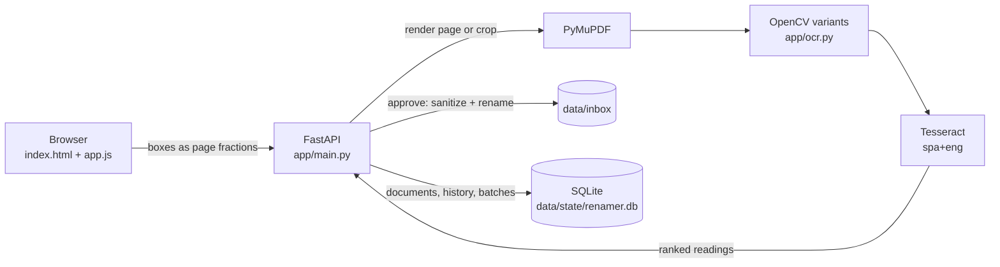

# Renombrador PDF

[Versión en español](README.es.md)

Batch-rename scanned PDFs: mark where the name is, let OCR read it, and approve every name before a file changes.

Renombrador PDF (Spanish for "PDF renamer") is a local web app for offices that receive stacks of scanned documents with names like `scan_0001.pdf` and need each file named after the person in it. You draw a box around the name on the page. The app runs Tesseract on that region only and proposes a filename. Nothing is renamed until a person has compared the proposal with the crop and approved it. The interface is in Spanish because it was built for a Spanish-speaking office; [README.es.md](README.es.md) is the user guide.


*Recorded with the demo PDF from `generate_demo_pdf.py`; the name in it is made up.*

There is no hosted demo: this is a local tool that reads and renames files on your own disk.

## Contents

- [Features](#features)
- [How it works](#how-it-works)
- [Engineering highlights](#engineering-highlights)
- [Tech stack and design decisions](#tech-stack-and-design-decisions)
- [Getting started](#getting-started)
- [Tests](#tests)
- [Configuration](#configuration)
- [Limitations](#limitations)
- [License](#license)
- [Author](#author)

## Features

- **Folder upload from the browser.** Use the folder picker, pick loose PDFs, or drag a folder onto the window. Subfolders are kept. If a batch name is already taken, the new one gets ` (2)`. You can also copy PDFs into `data/inbox` and press *Actualizar carpeta* (refresh folder).
- **OCR on marked regions only.** Draw one or more boxes. One box can cover a name that wraps onto several lines, and several boxes, even on different pages, are joined in order 1, 2, 3.
- **Several readings per box.** Each box goes through five image preprocessing variants, each read in two Tesseract page-segmentation modes, plus a word-by-word pass that rebuilds spacing from the gaps in the ink. The best reading is proposed. With a single box, the other distinct readings are listed too (up to eight entries), and a click swaps one in.
- **Review flag.** A result is marked for review when confidence is below 60, when it contains stray punctuation, or when the top readings disagree, even if confidence is high.
- **Crop preview.** The original crop and a contrast-enhanced version sit next to the editable name, so you can check it letter by letter.
- **Safe renames.** Accents are kept, characters Windows rejects are replaced, and reserved names such as `CON` or `LPT1` get a suffix. An existing file is never overwritten: ` (2)`, ` (3)` is appended instead. Only the file name changes; the PDF's content is not touched.
- **Skip, undo and history.** You can skip a hard document. Undo walks renames back newest-first and refuses if the old name has since been taken. Every rename, skip and undo is logged in SQLite.
- **ZIP export** for one batch or for everything, with either the approved files only or all files. A one-batch ZIP has the files at its root; a full ZIP keeps one folder per batch.
- **Batch cleanup.** Deleting a batch asks for confirmation, shows how many files will go, and warns if renamed files were never exported.
- **Keyboard flow.** `Enter` approves and jumps to the next pending document. The arrow keys move between documents and pages. Hold `Alt` to use the shortcuts while typing in the name field.
- **Offline.** Rendering and OCR run on your machine, and the app calls no external service.

## How it works

1. **Mark.** Drag a rectangle over the name. Boxes are stored as fractions of the page (0 to 1), so they don't depend on zoom or render resolution.
2. **Read.** The server renders just that region at 450 DPI with PyMuPDF. It adds a small margin so a box that clips the edge of a letter still reads, runs the preprocessing variants through Tesseract, and ranks the candidates.
3. **Review.** The panel shows the joined proposal, an advisory confidence, the alternatives, and the crops:

   

4. **Approve.** The name is sanitized, the file is renamed inside `data/inbox`, the action is logged, and the app moves to the next pending document.
5. **Export.** Download the batch as a ZIP, then clear it from the inbox.



## Engineering highlights

- **Upload paths can't escape the inbox.** Each path component the browser sends is cleaned: drive letters and `..` are dropped, characters Windows rejects become spaces, each component is capped at 120 characters, and only the last six levels are kept. Then the destination is checked with `resolve().relative_to(inbox)` before anything is written. The same check runs before any stored document is read, rendered or renamed. See `safe_upload_relative_path` in [`app/naming.py`](app/naming.py), and `_store_upload` and `_document_path` in [`app/main.py`](app/main.py).
- **Uploads are sniffed and capped.** The extension isn't trusted: the first five bytes must be `%PDF-`. The file is then copied into the inbox in 1 MB chunks, and the copy is deleted and rejected as soon as it passes 300 MB. See `_store_upload` in [`app/main.py`](app/main.py).
- **Deletion goes through a whitelist.** `POST /api/batches/{name}/delete` only accepts names in the `batches` table. Those are folders created by an upload, plus top-level inbox folders that the sync adopts. The endpoint refuses the inbox root and re-checks containment before `shutil.rmtree`, and loose PDFs in the inbox root never form a deletable batch. See `delete_batch` in [`app/main.py`](app/main.py) and the `batches` table in [`app/database.py`](app/database.py).
- **Disagreement between readings forces review.** `recognize_crop` collects every candidate, removes duplicates and ranks them. `_candidates_disagree` then compares the winner with the alternatives of similar confidence (`difflib` ratio below 0.985), so a 95% reading can still be flagged when another reading says something different. See [`app/ocr.py`](app/ocr.py).
- **Windows-safe names, validated input.** `sanitize_pdf_name` applies NFC normalization, replaces `<>:"/\|?*` and control characters, trims leading and trailing dots and spaces, and suffixes reserved device names (`CON` becomes `CON_`). `unique_target` picks a free ` (n)` name instead of overwriting. Request bodies are Pydantic models with bounds: box coordinates between 0 and 1, at most 20 boxes per request, and names of 1 to 220 characters. See [`app/naming.py`](app/naming.py) and [`app/models.py`](app/models.py).

## Tech stack and design decisions

| Layer | Choice | Why |
|---|---|---|
| API and server | Python 3.12, FastAPI, Uvicorn | One process serves the JSON API and the static UI; Pydantic validates request bodies. |
| PDF rendering | PyMuPDF | The viewer pages and the high-resolution OCR crops come from the same renderer, and the browser never parses a PDF. |
| OCR | Tesseract (via pytesseract), OpenCV | Runs offline, has good Spanish language data, and OpenCV handles the preprocessing. |
| State | SQLite in WAL mode | Holds document status, saved boxes, the action log behind undo, and the batch whitelist. |
| Front end | Plain HTML, CSS and JavaScript | Three static files and no build step. |

- **Approval is required by design.** OCR on scans makes mistakes, and a wrong filename costs more than a slow one. So every rename needs a click, and the crop is always shown next to the text.
- **Regions instead of full-page OCR.** The operator already knows where the name is. Reading a small crop at high resolution is quick and can't pick the wrong name from a page full of names.
- **The files are the source of truth.** On startup, and whenever you press *Actualizar carpeta*, the inbox is rescanned: new PDFs are added, vanished ones are marked missing, and returning ones are restored.
- **Uploads are copies.** Uploaded files are copied into `data/inbox/<batch>`, and renames happen there, so the originals on your disk are left alone.
- **Typed code.** The `app/` package has type annotations on every parameter, though no type checker runs in this repo.

### Project structure

```text
app/
  main.py            FastAPI routes: documents, OCR, approve/skip/undo, upload, batches, export
  ocr.py             page and crop rendering, preprocessing variants, Tesseract runs, ranking
  naming.py          filename and upload-path sanitizing, collision-free targets
  database.py        SQLite schema, inbox sync, action history, batch registry
  models.py          Pydantic request models
  config.py          settings from environment variables, Tesseract discovery
  static/            index.html, app.js, styles.css
tests/               pytest suite (naming, OCR helpers, launcher, HTTP API)
data/inbox/          PDFs to rename (contents git-ignored)
data/state/          SQLite database and temporary ZIP exports (git-ignored)
launcher.py          picks a free port, waits for /api/health, opens the browser
generate_demo_pdf.py writes a one-page demo PDF into data/inbox
setup_windows.bat    creates .venv and installs requirements (Windows)
run_windows.bat      starts the launcher (Windows)
stop_windows.bat     stops every running instance on ports 8765-8799 (Windows)
Dockerfile           Python 3.12 slim image with Tesseract (spa, eng)
docker-compose.yml   compose service with data/ mounted
```

## Getting started

### Prerequisites

- **Python 3.12.**
- **Tesseract OCR 5** with Spanish (`spa`) and English (`eng`) language data. This was checked with 5.3.3 on Windows and with 5.5.0 in the Docker image.

| OS | Install Tesseract |
|---|---|
| Windows | Run the [UB Mannheim installer](https://github.com/UB-Mannheim/tesseract/wiki). On the components page, open *Additional language data* and tick *Spanish*. |
| macOS (Homebrew) | `brew install tesseract tesseract-lang` |
| Debian / Ubuntu | `sudo apt-get install tesseract-ocr tesseract-ocr-spa` |

To check the install, run `tesseract --list-langs`; the output should list `eng` and `spa`. The app looks for Tesseract in this order:

1. the `TESSERACT_CMD` environment variable;
2. `tesseract` on `PATH`;
3. `C:\Program Files\Tesseract-OCR\tesseract.exe`;
4. `C:\Program Files (x86)\Tesseract-OCR\tesseract.exe`.

Once the app is running, `GET /api/health` reports `tesseract_ready` and the installed languages.

### Quick start

macOS / Linux:

```bash
python3.12 -m venv .venv
.venv/bin/python -m pip install -r requirements.txt
.venv/bin/python launcher.py
```

Windows (PowerShell):

```powershell
py -3.12 -m venv .venv
.venv\Scripts\python -m pip install -r requirements.txt
.venv\Scripts\python launcher.py
```

The launcher binds to `127.0.0.1` and takes the first free port from 8765 to 8799. It waits until `/api/health` answers, then opens your browser. Use `--port 8770` to choose the port and `--no-browser` to skip opening the browser; press `Ctrl+C` to stop. On Windows, `setup_windows.bat` and `run_windows.bat` do the same steps from a double-click. `stop_windows.bat` stops every running instance, and it checks `/api/health` on each port first, so it only stops this app.

To start Uvicorn yourself instead (shown for macOS / Linux; on Windows use `.venv\Scripts\python`):

```bash
.venv/bin/python -m uvicorn app.main:app --host 127.0.0.1 --port 8765
```

To try it with the demo document:

```bash
.venv/bin/python generate_demo_pdf.py
```

This writes `data/inbox/demo_nombre_dos_lineas.pdf`, a one-page PDF with a made-up name split over two lines. If the app is already running, press *Actualizar carpeta* to pick it up.

### Docker

```bash
docker build -t renombrador-pdf .
docker run --rm -p 127.0.0.1:8765:8000 -v "$PWD/data:/app/data" renombrador-pdf
```

Then open <http://127.0.0.1:8765>. The image already includes Tesseract with Spanish and English. The mount makes the container use this repo's `data/` folder, so files you copy into `data/inbox` show up in the app. In PowerShell the same two lines work unchanged. `docker-compose.yml` is also included, but it publishes the port on every network interface; see [Limitations](#limitations).

## Tests

```bash
.venv/bin/python -m pip install pytest httpx
.venv/bin/python -m pytest tests
```

On Windows, use `.venv\Scripts\python` in place of `.venv/bin/python`. FastAPI's `TestClient` needs `httpx`, which `requirements.txt` doesn't list.

The tests cover filename and upload-path sanitizing, OCR text cleanup and word segmentation, and the launcher's port selection. They also exercise the HTTP API against a temporary inbox: upload validation, path traversal, ZIP layout, batch-deletion rules and stable ordering. They don't need Tesseract.

## Configuration

The app reads these environment variables:

| Variable | Default | Purpose |
|---|---|---|
| `PDF_INPUT_DIR` | `data/inbox` | Folder scanned for PDFs. Uploads and renames happen here. |
| `PDF_STATE_DIR` | `data/state` | Holds the SQLite database (`renamer.db`) and the temporary ZIP files. |
| `PDF_OCR_DPI` | `450` | Resolution used to render a marked region for OCR. |
| `PDF_RENDER_DPI` | `150` | Default resolution of the page-image endpoint when a request doesn't pass `dpi`. The bundled UI always asks for 150, so this setting doesn't change the UI. |
| `OCR_LANGUAGES` | `spa+eng` | Tesseract language string. |
| `TESSERACT_CMD` | auto-detected | Full path to the `tesseract` executable. |

The defaults are relative to the repo root; a relative path you set yourself is resolved from the current directory. Some limits are fixed in code: 300 MB per uploaded file, 20 boxes per OCR request and 220 characters per name. The browser also sends uploads in requests of at most 25 files or 40 MB.

## Limitations

- **Local, single-user tool with no authentication.** No endpoint checks who is calling. Anyone who can reach the port can list, download, upload and rename files, and delete whole batches (with `shutil.rmtree`; there is no recycle bin). There is no CSRF protection either. Keep it on `127.0.0.1`, which is what the launcher and the `docker run` command above do, and **never expose it on a network**. `docker-compose.yml` maps `"8765:8000"`, which listens on all interfaces; change it to `"127.0.0.1:8765:8000"` before using compose.
- **Not hardened for untrusted files.** The only check on an upload is the `%PDF-` signature; after that, PyMuPDF parses whatever it receives. The 300 MB cap applies to the copy into the inbox, after the server has already received the request, so it doesn't limit request size.
- **`stop_windows.bat` and Docker don't mix.** The script force-stops whichever process listens on a matching port. While the container is published on 8765, that process belongs to Docker Desktop, so stop the container with `Ctrl+C` or `docker stop` instead.
- **One operator at a time.** State is a local SQLite file and nothing coordinates concurrent reviewers.
- **OCR quality follows scan quality.** The confidence number is advisory. Faint, skewed or handwritten names can need manual correction, which is why review can't be skipped.
- **Spanish-only interface.** The OCR languages can be changed with `OCR_LANGUAGES`, but every label and message is in Spanish.
- **Renames happen in place.** If you copy files into `data/inbox`, or mount a real folder over it, those files are renamed, and *Limpiar lote* deletes them. Only uploads through the browser are copies.
- **Tested platforms.** The app was run on Windows and in the Docker image (Debian). macOS has not been tested.

## License

Copyright © 2026 Adrián Gaona. All rights reserved. The source is public so it can be read and evaluated; no license is granted to reuse or redistribute it.

Third-party components keep their own licenses, including:

- [Tesseract OCR](https://github.com/tesseract-ocr/tesseract): Apache-2.0
- [PyMuPDF](https://github.com/pymupdf/PyMuPDF): AGPL-3.0 or an Artifex commercial license
- OpenCV (`opencv-python-headless`), pytesseract and python-multipart: Apache-2.0
- FastAPI and Pydantic: MIT; Pillow: MIT-CMU; Uvicorn and Starlette: BSD-3-Clause

## Author

**Adrián Gaona** · [adriangaona.dev](https://www.adriangaona.dev) · [LinkedIn](https://www.linkedin.com/in/jesus-lopez-95762b2b6) · [GitHub](https://github.com/jadrianlg16)
